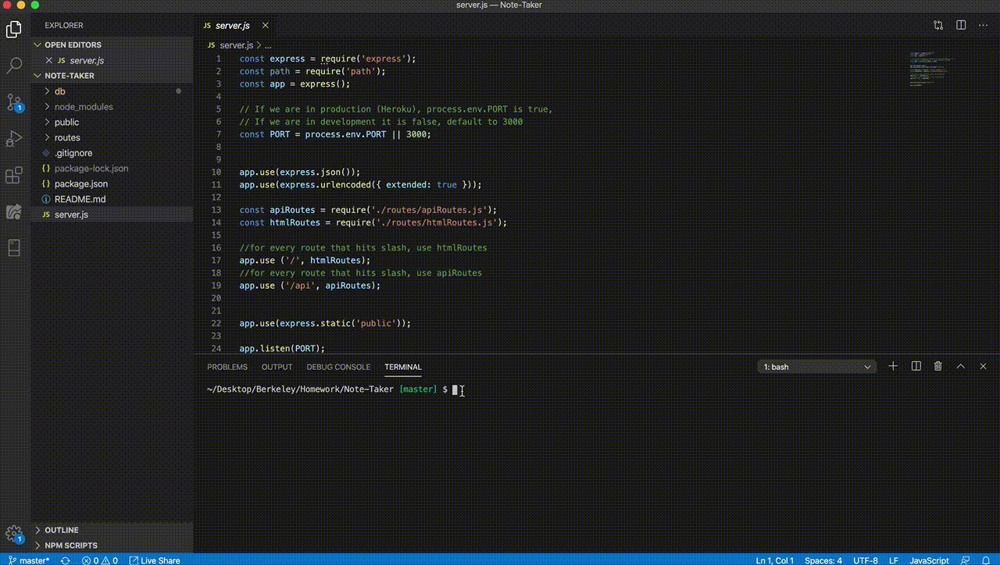

# Unit 11 Express Homework: Note Taker

## Description


This project describes how to create a command-line application that that can be used to write, save, and delete notes. This application will use an express backend and save and retrieve note data from a JSON file. 

The application will be invoked with the following command:

```sh
node server.js
```

## User Story

AS A user, I want to be able to write and save notes

I WANT to be able to delete notes I've written before

SO THAT I can organize my thoughts and keep track of tasks I need to complete

## Business Context

For users that need to keep track of a lot of information, it's easy to forget or be unable to recall something important. Being able to take persistent notes allows users to have written information available when needed.

 ## Link to the deployed application
 https://limitless-spire-35515.herokuapp.com/

## Video of the application functionality





